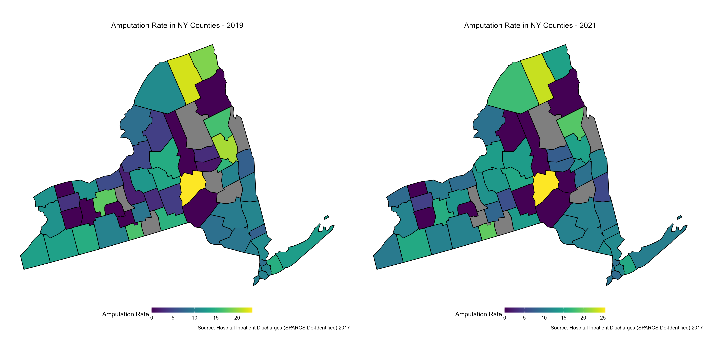
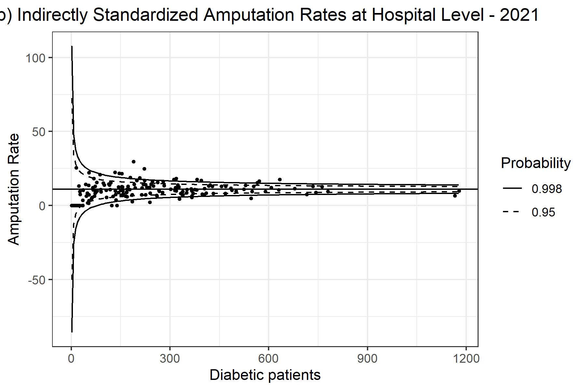
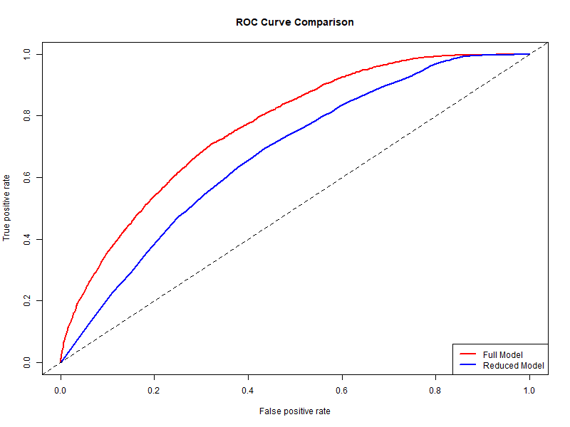

# COVID-19 and Amputations: Exploring the Impact of the Pandemic on Diabetic Patients

## Description
This project investigates the impact of the COVID-19 pandemic on the incidence of lower extremity amputations (LEAs) among diabetic patients in New York State. Using data from before (2019) and after (2021) the initial outbreak of COVID-19, it analyzes hospital and county-level variations in amputation rates and evaluates how demographic, clinical, and socio-economic factors influenced these trends.

The study employs direct and indirect standardization methods, logistic regression, and Generalized Estimating Equation (GEE) models to provide insights into the healthcare challenges posed by the pandemic.

---

## Key Findings
- A significant increase in amputation rates in 2021 compared to 2019, highlighting the potential indirect impact of the pandemic on diabetic care.
- Identification of risk factors, including age, sex, race, and severity of diabetes, that significantly influence amputation likelihood.
- ROC curve analysis showing strong predictive performance for models incorporating clinical severity and demographic factors.

---

## Key Features
- **Data Analysis**: In-depth analysis of hospital inpatient discharges focusing on diabetic patients undergoing LEA.
- **Standardization Techniques**: Application of direct and indirect standardization methods to adjust for population composition differences.
- **Statistical Modeling**: Multivariate logistic regression and GEE models to identify key risk factors for amputations.
- **Visualizations**: Generation of maps, funnel plots, and ROC curves to visualize trends and results.

---

## Folder Structure
- **`raw/`**: Contains raw datasets for analysis.  
  - Files: `fips_counties.csv`, `Hospital_Inpatient_Discharges_2019.csv`, `Hospital_Inpatient_Discharges_2021.csv`

- **`data/`**: Contains pre-processed datasets.  
  - Files: `diab_2019.Rda`, `diab_2021.Rda`, `diab_all.Rda`

- **`output/`**: Stores all visualizations, tables, and result summaries.  

- **`program/`**: R scripts for analysis:
  1. `00_data_manipulation.R` (Optional): Prepares pre-processed datasets.
  2. `01_summary_statistics.R`: Produces summary statistics for the datasets.
  3. `02_standardization.R`: Computes direct and indirect standardized rates.
  4. `03_modeling.R`: Fits logistic regression and GEE models, and evaluates their performance.

---

## Visual Highlights
### County-Level Amputation Rates


### Funnel Plot


### ROC Curve


---

## Getting Started
### Prerequisites
Ensure the following tools are installed:
- R (version 4.0.0 or later)
- R packages: `dplyr`, `ggplot2`, `sf`, `geepack`, `pROC`

### Running the Analysis
1. Clone the repository:
   ```bash
   git clone https://github.com/chiara-cattani/COVID-19-and-Amputations.git
   cd COVID-19-and-Amputations
